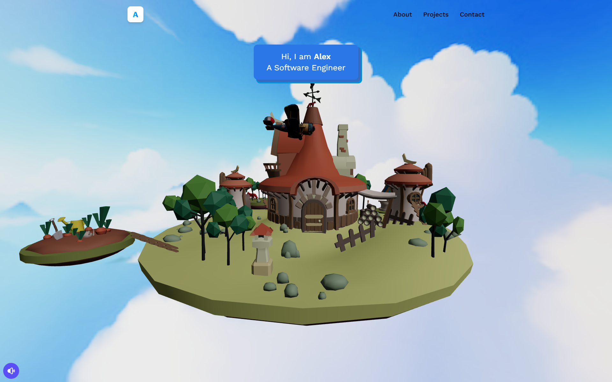

# 3D Portfolio

A modern, interactive 3D portfolio built with **React**, **@react-three/fiber**, and **Vite**. The site showcases a rotating island, a plane that orbits the island, and a responsive UI with custom styling.

## ✨ Features

- **3D scene** with island, sky, bird, and animated plane using three‑js via `@react-three/fiber`.
- **Responsive design** – layout adapts for mobile and desktop.
- **Audio background** with controllable playback.
- **Dynamic content** – HomeInfo component displays different messages based on the current stage.
- **Custom CSS** using Tailwind‑like utilities and a dark‑mode aesthetic.

## 🛠️ Tech Stack

- **React** (hooks, functional components)
- **Vite** – fast dev server & bundler
- **@react-three/fiber** – React renderer for three‑js
- **Three.js** – 3D graphics
- **Tailwind‑style utilities** (via custom CSS)
- **React Router** – navigation between pages

## 📦 Installation

```bash
# Clone the repository
git clone https://github.com/your-username/3d_porfolio.git
cd 3d_porfolio

# Install dependencies
npm install
```

## ▶️ Development

```bash
npm run dev
```

Open `http://localhost:5173` in your browser.

## 📦 Build for Production

```bash
npm run build
```

The static files will be generated in the `dist/` folder.

## 🎨 Styling

The project uses a custom CSS file (`src/index.css`) that imports Google fonts and defines a Tailwind‑like utility layer. Feel free to adjust the color palette, shadows, and spacing to match your brand.

## 🚀 Deploy

You can deploy the `dist/` folder to any static‑hosting service (GitHub Pages, Vercel, Netlify, etc.). Example for GitHub Pages:

```bash
npm run build
# push the contents of dist/ to the gh-pages branch
```

## 📸 Screenshots



## 🤝 Contributing

Feel free to open issues or submit pull requests. Please follow the existing code style and run `npm run lint` before submitting.

## References

- Inspired by the tutorial series from [Adrian Hajdin](https://github.com/adrianhajdin).

## 📄 License

This project is licensed under the MIT License.
